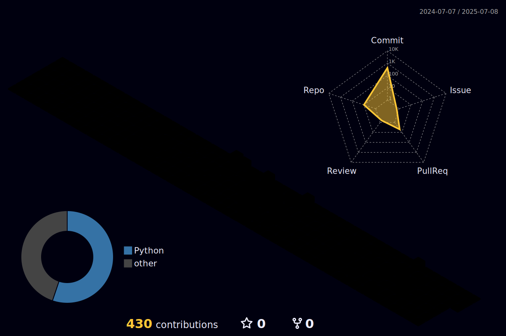

  

### 🖐️Hi I'm interested in ML, CV, and RL with mobile robots. 

  <h3> 📫Feel free to contact me via &nbsp
    <a href="mailto:wjdgus21@kyonggi.ac.kr">
      &nbsp
    </a>
    <a href="https://dvlhyeon248.tistory.com/">
      &nbsp
    </a> 
  </h3>

  <!-- a href="https://www.linkedin.com/in/%EC%A0%95%ED%98%84-%EC%B5%9C-368051312/">
    &nbsp
  </a-->
  <!--a href="https://www.instagram.com/dvl.hyun_/">
    &nbsp
  </a>
  </div-->  
 

## 💫Skills

  &nbsp
  &nbsp
  &nbsp
  &nbsp
  &nbsp
  &nbsp
  &nbsp
  &nbsp

 

## 🎓Papers
- 📄 [물체 자세 추정기를 이용한 지능형 로봇의 테이블 정리 서비스 개발](https://doi.org/10.5302/J.ICROS.2023.22.0153) - 2022.06, KIIT Conference
- 📄 [목표 기반 시각적 이동 작업을 위한 시각적 맥락정보 임베딩과 교착상태 처리](https://doi.org/10.5302/J.ICROS.2023.22.0153) - 2023.01, Journal of ICROS (JICRS)
- 📄 [멀티모달 맥락정보 융합에 기초한 다중 물체 목표 시각적 탐색 이동](https://doi.org/10.3745/KTSDE.2023.12.9.407) - 2023.09, Journal of KIPS (KTSDE)
- 📄 [다중 물체 시각적 탐색 이동을 위한 목표 물체 그라운딩과 멀티모달 지도 작성](https://doi.org/10.5302/J.ICROS.2024.23.0217) - 2024.06, Journal of ICROS (JICRS)
- 📄 [언어-기반 제로-샷 물체 목표 탐색 이동 작업들을 위한 인공지능 기저 모델들의 활용](https://doi.org/10.7746/jkros.2024.19.3.293) - 2024.08, Journal of KROS (JKROS)

 

## 🖥️Projects
- 🤖 [Jackal 로봇을 활용한 제로-샷 실내 순회·감시 서비스 개발](https://github.com/checkjunghyeon/Patrol_Service.git)
- 🤖 [두산 ROKEY 지능-1 파이널 프로젝트](https://github.com/checkjunghyeon/C3_Turtlebot4_Nav.git)
- 🤖 [두산 ROKEY 협동-1 파이널 프로젝트](https://github.com/checkjunghyeon/Convenience-store-chef.git)

 

## 📊Stats
<picture>
  <source
    srcset="https://github-readme-stats.vercel.app/api/top-langs/?username=checkjunghyeon&layout=donut&show_icons=true&theme=material-palenight&hide_border=true&bg_color=20232a&icon_color=58A6FF&text_color=fff&title_color=58A6FF&count_private=true&exclude_repo=Face-Transfer-Application" width=38%"
    media="(prefers-color-scheme: dark)"
  />
  <source
    srcset="https://github-readme-stats.vercel.app/api/top-langs?username=checkjunghyeon&show_icons=true"
    media="(prefers-color-scheme: light), (prefers-color-scheme: no-preference)"
  />
  
</picture>

<picture>
  <source
    srcset="https://github-readme-stats.vercel.app/api?username=checkjunghyeon&show_icons=true&theme=material-palenight&hide_border=true&bg_color=20232a&icon_color=58A6FF&text_color=fff&title_color=58A6FF&count_private=true" width=56%"
    media="(prefers-color-scheme: dark)"
  />
  <source
    srcset="https://github-readme-stats.vercel.app/api?username=checkjunghyeon&show_icons=true"
    media="(prefers-color-scheme: light), (prefers-color-scheme: no-preference)"
  />
  
</picture>
<!--/div-->  

 
 

 
 

